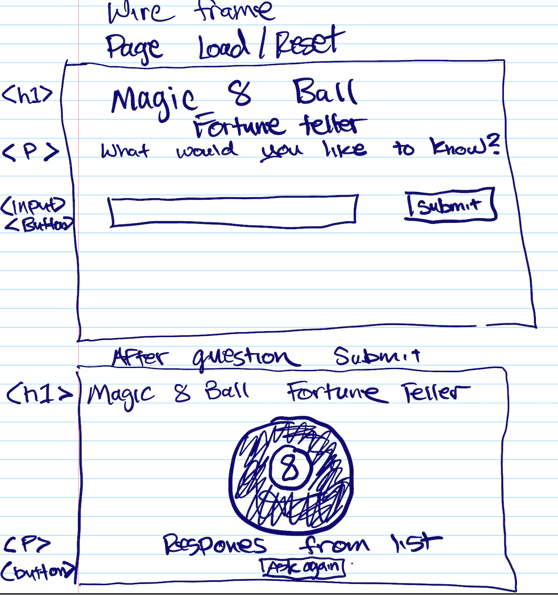

# Magic 8 Ball Plan

## States

-   load/reset screen
-   Repsonse screen

## HTML Elements on load/reset

-   h1 for the header
-   section with p for the prompt
-   input for user question
-   button

## HTML Elements after submit

-   h1 for the header
-   image of 8 ball
-   response
-   button to re ask

## Events

-   Button Click
-   Hide the prompt
-   Display the image
-   pick a random # between zero and the number of answers in array minus one
-   display an element from the array indexed as the random number
-   button click (ask again?)
-   hide the 8 ball
-   show prompt, input and submit button
